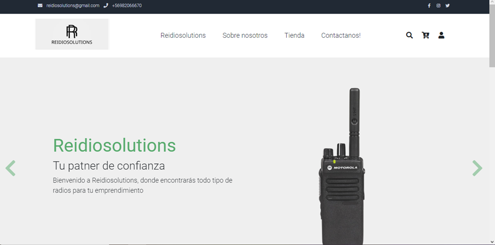

# My Project


## 📌 Description
ReidioSolutions is an eCommerce platform specialized in radiocommunications hardware, in which organizations and businesses will have access to a unified platform where they can obtain not only the required equipment but also all related components and services. This will include the option to manage necessary licenses, purchase compatible accessories, and receive centralized technical support. By consolidating all these needs in a single site, operational complexities will be reduced, hardware management efficiency will be enhanced, and redundancies will be minimized.



## 🚀 Features
- User Authentication & Management: Secure sign up system with email verification.
- Product Catalog Management: Allows easy addition, modification, and categorization of radio communication products.
- Shopping Cart & Checkout: Streamlined checkout process with order summary and secure transactions.
- Stock & Inventory Tracking: Track and manage existing inventory as well as the posibility of adding new products to the catalogue.
- Order management: ability to visualize users orders and their shipment information.

[](https://www.youtube.com/watch?v=8xU6RJT5EP8)

## 🛠️ Tech Stack

* **Backend:**
    * Django (Python)
    * MySQL
    * PayPal REST SDK
* **Frontend:**
    * HTML
    * CSS
    * JavaScript

## 📦 Installation
1.  **Clone the repository:**
    ```bash
    git clone https://github.com/SamuelMattos7/RadiocommunicationsEcommerce.git
    ```

2.  **Navigate to the project directory:**
    ```
    cd RadiocommunicationsEcommerce
    cd ProjectFinal
    ```

3.  **Create a virtual environment (Recommended):**
    ```
    python -m venv venv  # For Python 3.3+
    # or
    # python3 -m venv venv # If python is linked to python3
    ```

4.  **Activate the virtual environment:**
    * **On Windows (Command Prompt):**
        ```
        venv\Scripts\activate
        ```

4.  **Navigate to proyecto folder and install the dependencies and run the server:**
    ```
    cd Proyecto
    pip install -r requirements.txt
    py manage.py runserver
    ```